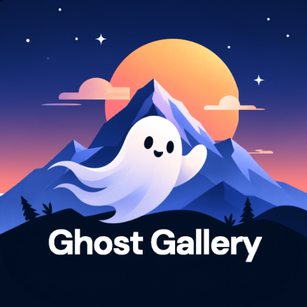

<div align="center">



# Ghost Gallery

### Fast, Intelligent, and Privacy-Focused Offline Gallery for All Android Screens

[](https://flutter.dev)
[](https://dart.dev)
[](https://android.com)
[](LICENSE)
[](https://buymeacoffee.com/somnathdash)

<br/>

<a href="https://buymeacoffee.com/somnathdash" target="_blank">
  
</a>

<br/><br/>

**Ghost Gallery** is a modern, high-performance Android gallery built with Flutter. Engineered with an offline-first philosophy, it combines local machine learning intelligence, encryption, and seamless responsive scaling across **smartwatches (Wear OS), phones, foldables, tablets, and Android TV**.

[Features](#-key-features) • [Screenshots](#-screenshots) • [Architecture](#-architecture--tech-stack) • [Contributions](#-contributions) • [Support](#-support--donations)

</div>

---

## 🌟 Key Features

### 🔒 Encrypted Private Vault
- **Zero-Knowledge Architecture**: Secure photos and videos behind hardware-backed biometrics (fingerprint / face recognition) or PIN.
- **Military-Grade Encryption**: Files stored in the Vault are encrypted on-device via AES-256.
- **Privacy Safeguards**: Hidden from the system media store, file managers, and third-party scanners.

### 🧠 On-Device AI & Semantic Search
- **100% Offline Processing**: All AI inference runs locally on your device with no cloud uploads or tracking.
- **Face Detection & Clustering**: Automatic face grouping powered by Google ML Kit and TensorFlow Lite.
- **OCR Text Recognition**: Extract and search text directly from receipts, screenshots, documents, and signs.
- **Smart Object & Scene Labeling**: Search media by labels like *landscape*, *food*, *pets*, *documents*, or *vehicles*.

### 🗺️ GPS Map & Geotag Explorer
- **Interactive Photo Map**: Visualize your memories on an interactive map powered by OpenStreetMap (`flutter_map`).
- **No Proprietary API Keys**: Free, privacy-respecting geospatial browsing without external tracking.
- **Location Clustering**: Group photos by country, city, and neighborhood.

### 🎨 Built-in Creative Studio
- **Pro Photo Editor**: Crop, rotate, annotate, apply filters, and tune exposure/contrast.
- **Pro Video Editor**: Frame-accurate video trimming, audio adjustments, and high-quality exports.
- **Collage Creator**: Combine multiple pictures into customizable grid layouts.
- **Audio Trimmer**: Precision audio cutting and management for multimedia stories.

### 🧹 Storage Cleaner & Duplicate Detection
- **Visual Duplicate Finder**: Detect identical and near-duplicate images using perceptual hashing.
- **Junk & Blur Cleaner**: Identify blurry shots, redundant bursts, and oversized files to reclaim storage.

### 📱 Full-Spectrum Adaptive UI
- Tailored for all screen configurations via dynamic breakpoint management:
  - ⌚ **Wear OS / Smartwatches** (Ultra-compact layouts and gesture controls)
  - 📱 **Smartphones & Foldables** (One-handed navigation and fluid pinch-to-zoom)
  - 📟 **Tablets & Desktops** (Multi-pane adaptive layouts and sidebars)
  - 📺 **Android TV** (D-Pad navigation and high-resolution cinema viewing)

### ⚡ AMOLED & Custom Themes
- **AMOLED True Black**: Maximize battery life on OLED displays.
- **Curated Themes**: Includes JetBrains Darcula, Putty White, and adaptive Light/Dark palettes.
- **Memory Capping**: Custom image cache manager to ensure 60/120 FPS scrolling without Out-Of-Memory crashes.

---

## 📸 Screenshots

<p align="center">
  
  
</p>
<p align="center">
  
  
</p>

<p align="center">
  
 
</p>
<p align="center">
  
  
   
</p>

---

## 🏗 Architecture & Tech Stack

```
ghost_gallery/
├── android/                 # Native Android host configuration
├── android_media_manager/   # Low-level native Android MediaStore bridge
├── assets/                  # Mascot art, icons, and ML model assets
├── lib/
│   ├── config/              # Centralized routes, constants, and social links
│   ├── models/              # ObjectBox entities and data schemas
│   ├── screens/
│   │   ├── tabs/            # Photos, Albums, Recommended, and Search tabs
│   │   ├── vault/           # Biometrics, PIN entry, and encrypted storage
│   │   └── ...              # Map view, editors, and settings
│   ├── services/            # ML engine, DB helpers, cache, and responsive logic
│   └── widgets/             # Reusable UI components, painters, and dialogs
└── test/                    # Unit and integration tests
```

| Layer | Technology |
|---|---|
| **Framework** | [Flutter](https://flutter.dev) (Dart 3.x) |
| **Local Database** | [ObjectBox](https://objectbox.io) & [SQLite (sqflite)](https://pub.dev/packages/sqflite) |
| **On-Device AI** | [Google ML Kit](https://developers.google.com/ml-kit) & [TensorFlow Lite](https://www.tensorflow.org/lite) |
| **Mapping** | [flutter_map](https://pub.dev/packages/flutter_map) & OpenStreetMap |
| **Media Editors** | `pro_image_editor`, `pro_video_editor`, `ffmpeg_kit_flutter_new` |
| **Security & Crypto** | `local_auth`, `encrypt` (AES-256), `crypto` |

---

## 🤝 Contributions

Contributions, bug reports, and feature requests are welcome! Feel free to check the [issues page](https://github.com/sddev7/Ghost-Gallery/issues) or submit a pull request.

### Prerequisites & Setup
- [Flutter SDK](https://docs.flutter.dev/get-started/install) (`^3.11.5` or higher)
- [Android Studio](https://developer.android.com/studio) or VS Code with Flutter extensions
- Android SDK (API 26 or newer recommended)

### How to Contribute

1. **Fork the repository**
2. **Clone your fork:**
   ```bash
   git clone https://github.com/sddev7/Ghost-Gallery.git
   cd Ghost-Gallery
   ```
3. **Install dependencies:**
   ```bash
   flutter pub get
   ```
4. **Generate database models:**
   ```bash
   dart run build_runner build --delete-conflicting-outputs
   ```
5. **Create a feature branch:**
   ```bash
   git checkout -b feature/amazing-feature
   ```
6. **Commit your changes:**
   ```bash
   git commit -m "feat: add amazing feature"
   ```
7. **Push to the branch:**
   ```bash
   git push origin feature/amazing-feature
   ```
8. **Open a Pull Request**

---

## ☕ Support & Donations

If Ghost Gallery helps you manage your photos privately or saves you time, consider supporting the development! Your support keeps this project active, open-source, and constantly improving.

<div align="center">

<a href="https://buymeacoffee.com/somnathdash" target="_blank">
  
</a>

<br/><br/>

[](https://github.com/sddev7/Ghost-Gallery)
&nbsp;
[](https://play.google.com/store/apps/dev?id=5205870768278368922)
&nbsp;
[](https://x.com/SDdev__)
&nbsp;
[](https://www.instagram.com/sddev_)

<br/><br/>

[🔒 Privacy Policy](https://ghosteco.sddev.in/apps/ghost-gallery/privacy/) • [💬 Feedback & Bug Report](https://ghosteco.sddev.in/feedback/?app=ghost-gallery)

</div>

---

## 📄 License

This project is licensed under the [GNU General Public License v3.0](LICENSE) - see the [LICENSE](LICENSE) file for details.

<div align="center">
  <sub>Crafted with care by <a href="https://github.com/somnathdashs">Somnath Dash (SD Dev)</a> for the Ghost Series Ecosystem.</sub>
</div>
